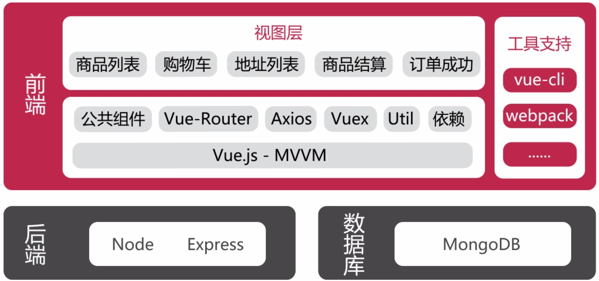
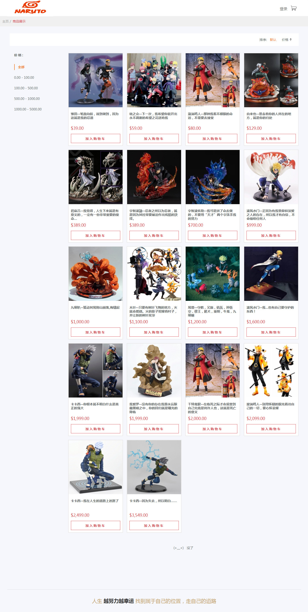
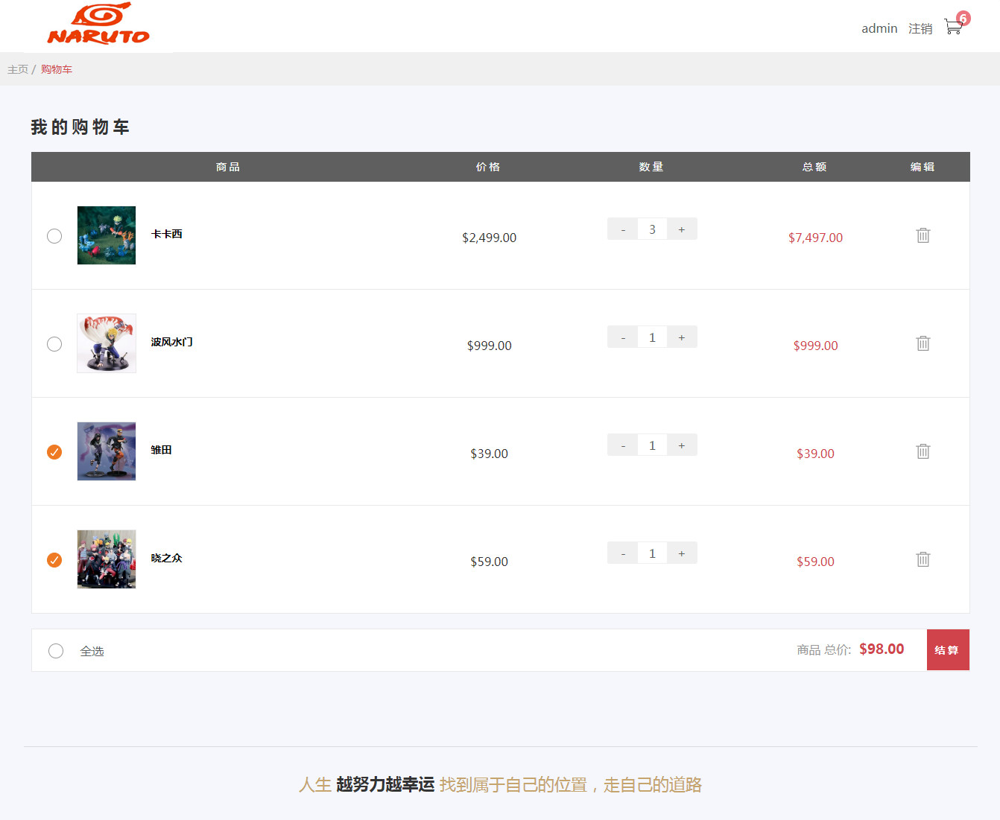

# 火影手办小商城

基于 **Vue 全家桶 (2.x) + Node.js + Express + MongoDB + ES6** 制作的购物商城系统 (仿慕课网)，通过实现简易的商城流程来学习当下最热最流行的大前端框架和技术，商城采用前后端分离的开发方式，前后端通过json数据交流

## 技术栈



【前端】

- `Vue`：用于构建用户界面的 MVVM 框架。它的核心是**响应的数据绑定**和**组系统件**
- `vue-router`：为单页面应用提供的路由系统
- `vuex`：Vue 集中状态管理，在多个组件共享某些状态时非常便捷。项目的登录状态和购物车数量等状态在每个页面都需要使用，因此使用 Vuex 来集中管理，大大降低我们组件开发数据传递的复杂度
- `axios`：服务端通讯。Express 提供 Rest 接口对接前端，前端所有的请求均通过 axios 来实现数据接收和页面渲染
- `vue-lazyload`：第三方图片懒加载库，优化页面加载速度
- `vue-infinite-scroll`：Vue 滚动插件
- `ES6`：ECMAScript 新一代语法，模块化、解构赋值、Promise等方法非常好用

【后端】

- `Node.js`：整个商城后台通过 Node.js 进行实现，通过 Express 框架实现后端的 REST 接口，并以 json 的形式进行输出

【数据库】

- `mongoDB`：NoSQL 数据库，使用 mongoose (Node.js 的 mongodb 驱动软件包) 进行 mongoDB 快速建模

【自动化构建及其他工具】

- `vue-cli`：Vue 脚手架工具，快速初始化项目代码

## 收获

1. 掌握了在项目中运用 Vue 全家桶解决各类型问题
2. 熟悉了 vue 组件之间的交互、传值
3. 熟悉了在 vue 项目中使用第三方插件（组件）
4. 熟悉了组件化、模块化的开发思维
5. 体会到了前后端分离开发方式的好处


## 实现细节

主要页面：首页 (商品模块)、用户模块、购物车模块、地址模块、订单模块
主要组件：头部组件，模态框组件，面包屑组件，底部组件

**首页 (商品模块)**

左侧是按价格过滤功能，当屏幕尺寸缩小时，会有响应式改变

右侧为商品列表页，商品采用卡片式展示，可以按价格排序，默认显示 8 条数据，启动下拉加载并有 loading 效果，图片采用懒加载优化页面加载速度

商品的数据通过 MongoDB 进行存储，并做了分页和 `loading` 处理

**用户模块**

头部是一个导航栏，包括登录和购物车入口，登录初始账号：`admin ---- 123456`

前端通过 axios 请求后端 Express 路由，后端返回数据

用户模型存储在 MongoDB 中，当用户登入时，在 cookie 中记录，注销时清除 cookie

**购物车模块**

购物车数量状态通过 `Vuex` 管理，数量的加减会实时反映到购物车角标，数量和金额通过vue计算属性来实时变化

**地址模块**

地址的 MongoDB 数据库模型是 USER 模型的一部分，可以设置默认收货地址

默认显示 3 条地址

**订单模块**

通过路由传参：`:to="{ path: 'orderConfirm', query:{ 'addressId': selectedAddrId } }"`

订单号在服务器端生成，采用 “平台码 + 随机数 + 时间戳” 的形式


## 安装

``` bash
# 克隆项目到你的本地
$ git clone https://github.com/SuDaoJun/vue-narutoShop.git

# 安装依赖
$ npm install

# 从resource中导入json数据商品narutoShop-goods和用户narutoShop-users到MongoDB数据中，可以通过robomongo可视化工具导入

# 运行 Node.js
$ node server/bin/www

# 运行 Vue
$ npm run dev
```

## 效果图

**首页 (商品模块)**


**购物车**



